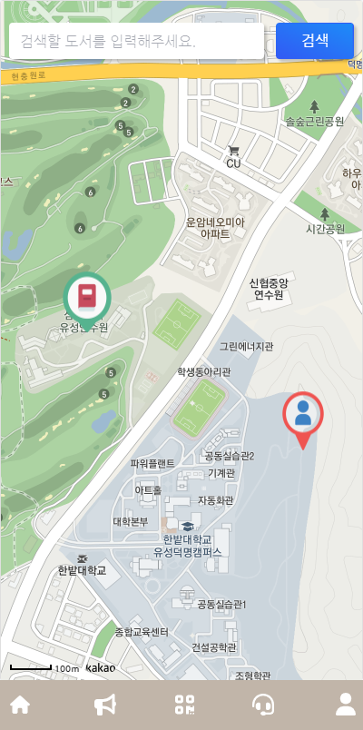
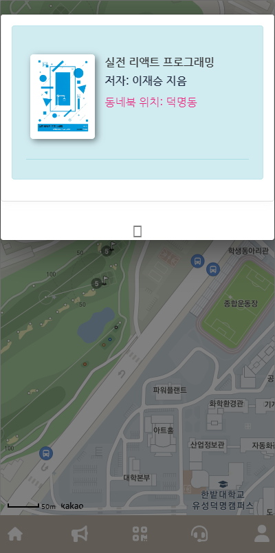
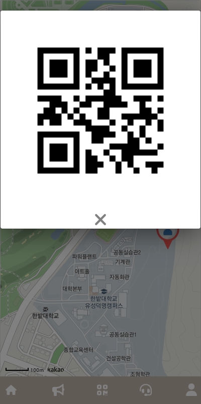
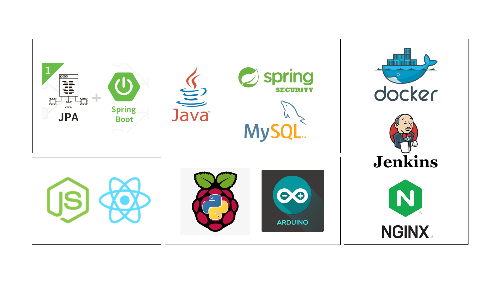
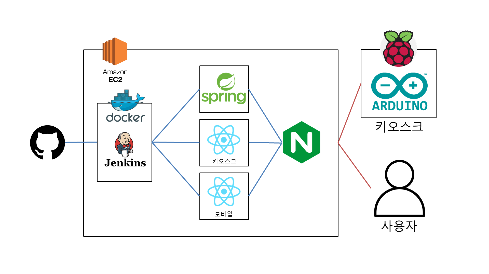
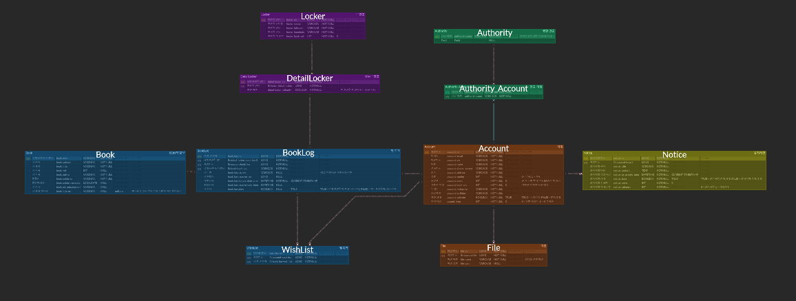
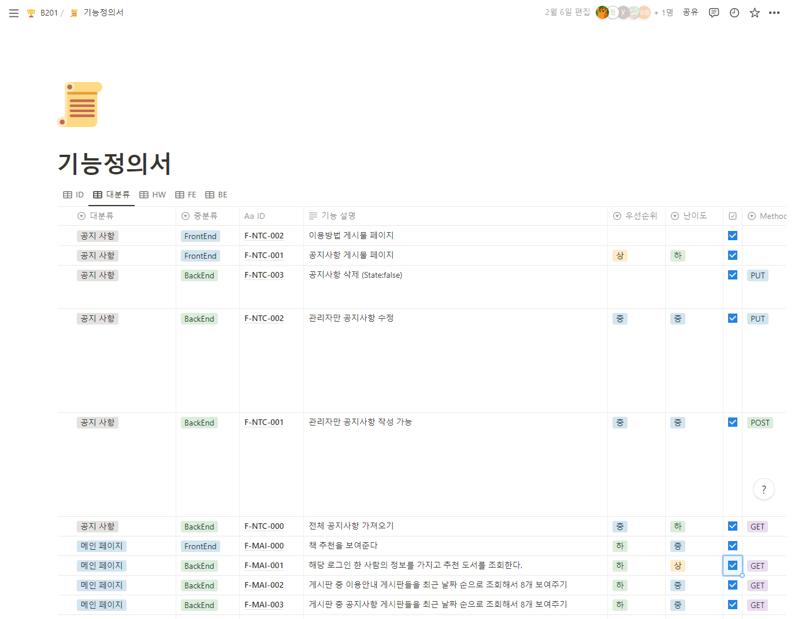
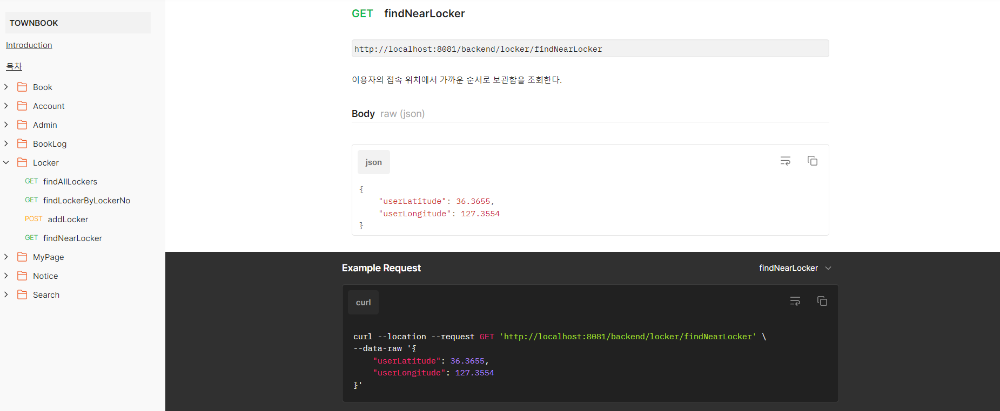

# TownBook

### Index

-   [TownBook](#townbook)
-   [Description](#description)
-   [Design](#design)
-   [HardWare](#hardware)
-   [Front-End](#front-end)
-   [Back-End](#back-end)
-   [Team-Member](#team-member)

### 전체 개요

동네북 프로젝트는 웹 페이지로 제공되는 도서 기부, 수령 서비스입니다.

주요 기획 의도는 개발진의 역량 향상과 소외 계층을 위한 도서 전달 서비스 개발입니다.

2권을 기부하면 기부자에게 1권, 소외 계층에게 1권을 돌려주는 서비스로 개발했습니다.

기존 서비스(도서관 등)의 운영시간 제한과 불편한 접근성을 해결하기 위해 24시간 이용 가능한

키오스크를 동네마다 설치하는 방향으로 기획했습니다.

### 화면 개요

#### 키오스크 화면

<p align="center">


</p>

#### 웹 페이지 화면

<p align="center">



</p>

# Description

### 주요 기능

#### 바코드

바코드 리더기를 이용하여 회원의 QR코드와 도서의 바코드를 인식하여 필요한 정보를 전달할 수 있다.

<p align="center">


</p>

#### 도서 기부

웹 페이지 이용과 회원가입 없이 간편하게 도서 기부가 가능하며, 2권 기부시 1권은 소외 계층에게 전달됩니다.

`회원으로 2권 기부시 이용자 1권, 소외 계층 1권 전달`

<p align="center">


</p>

#### 도서 수령

모바일로 QR코드를 발급 받고 원하는 도서를 수령할 수 있다.

`2권 기부에 해당하는 포인트 차감`

<p align="center">


</p>

# Design

### 기술 스택

<p align="center">

</p>

### 시스템 구조

<p align="center">

</p>

### ERD 다이어그램

<p align="center">

</p>

### 요구사항 명세서

<p align="center">

</p>

### API 명세서

<p align="center">

</p>

[API 명세서](https://documenter.getpostman.com/view/25310566/2s935snMhq)

# :computer: HardWare

### 사용한 라이브러리

| name        | description     | version | link                                                               |
| :---------- | :-------------- | :------ | :----------------------------------------------------------------- |
| Rasbian     | 라즈베이파이 OS | 1.7.3   | [Rasbian](https://www.raspberrypi.com/software)                    |
| Arduino IDE | 아두이노 IDE    | 1.8.19  | [Arduino IDE](https://wiki-content.arduino.cc/en/software)         |
| WifiESP.h   | 와이파이 통신   |         | [WifiESP.h](https://www.arduinolibraries.info/libraries/wi-fi-esp) |

### 디렉토리 구조

```text
📁townbook
├──📁espwifi2
└──📁servo_ardu
```

# :bar_chart: Front-End

### 사용한 라이브러리

| name | description | version | link |
| :--- | :---------- | :------ | :--- |

### 디렉토리 구조

```text
📁mobile
├──📁public
└──📁src
    ├──📁assets
    │   ├──📁css
    │   ├──📁demo
    │   ├──📁fonts
    │   ├──📁img
    │   └──📁scss
    ├──📁components
    │   ├──📁BackgroundColorWrapper
    │   ├──📁FixedPlugin
    │   ├──📁Footer
    │   ├──📁Navbars
    │   ├──📁Sidebar
    │   └──📁ThemeWrapper
    ├──📁context
    ├──📁layouts
    │   └──📁Admin
    ├──📁variables
    └──📁views
        ├──📁accout
        ├──📁map
        └──📁notice
📁kiosk
├──📁public
└──📁src
    ├──📁Kiosk
    │   ├──📁Donate
    │   ├──📁Member
    │   ├──📁Non-Member
    │   ├──📁Receipt
    │   └──📁img
    └──📁ui
```

# :telescope: Back-End

### 사용한 라이브러리

| name             | description                   | version | link                                                                                |
| :--------------- | :---------------------------- | :------ | :---------------------------------------------------------------------------------- |
| Spring Framework | Java Web Framework            | 5.3.24  | [Spring Framework](https://spring.io/)                                              |
| Spring Boot      |                               | 2.7.7   | [Spring Boot](https://spring.io/)                                                   |
| Spring Data Jpa  | Persist Data in SQL           | 2.7.6   | [JPA](https://docs.spring.io/spring-data/jpa/docs/current/reference/html/)          |
| Query DSL        |                               | 5.0.0   | [Query DSL](http://querydsl.com/static/querydsl/3.6.3/reference/ko-KR/html_single/) |
| Spring Security  | 인증 및 접근 관리             | 5.7.6   | [Spring Security](https://docs.spring.io/spring-security/reference/index.html)      |
| MySQL            | Database                      | 8.0.31  | [MySQL](https://dev.mysql.com/doc/)                                                 |
| Swagger Ui2      | API Document                  | 3.0.0   | [Swagger](https://swagger.io/docs/)                                                 |
| SMTP             | Simple Mail Transfer Protocol | 1.6.7   |                                                                                     |

### 디렉토리 구조

```text
📁townbook
├──📁controller
├──📁model
│   ├──📁dto
│   │   ├──📁request
│   │   └──📁response
│   ├──📁entity
│   ├──📁repository
│   └──📁service
└──📁query
```

# Team-Member

### :computer: HardWare

<p align="left">

</p>

### :bar_chart: Front-End

<p align="left">


</p>

### :telescope: Back-End

<p align="left">


</p>
